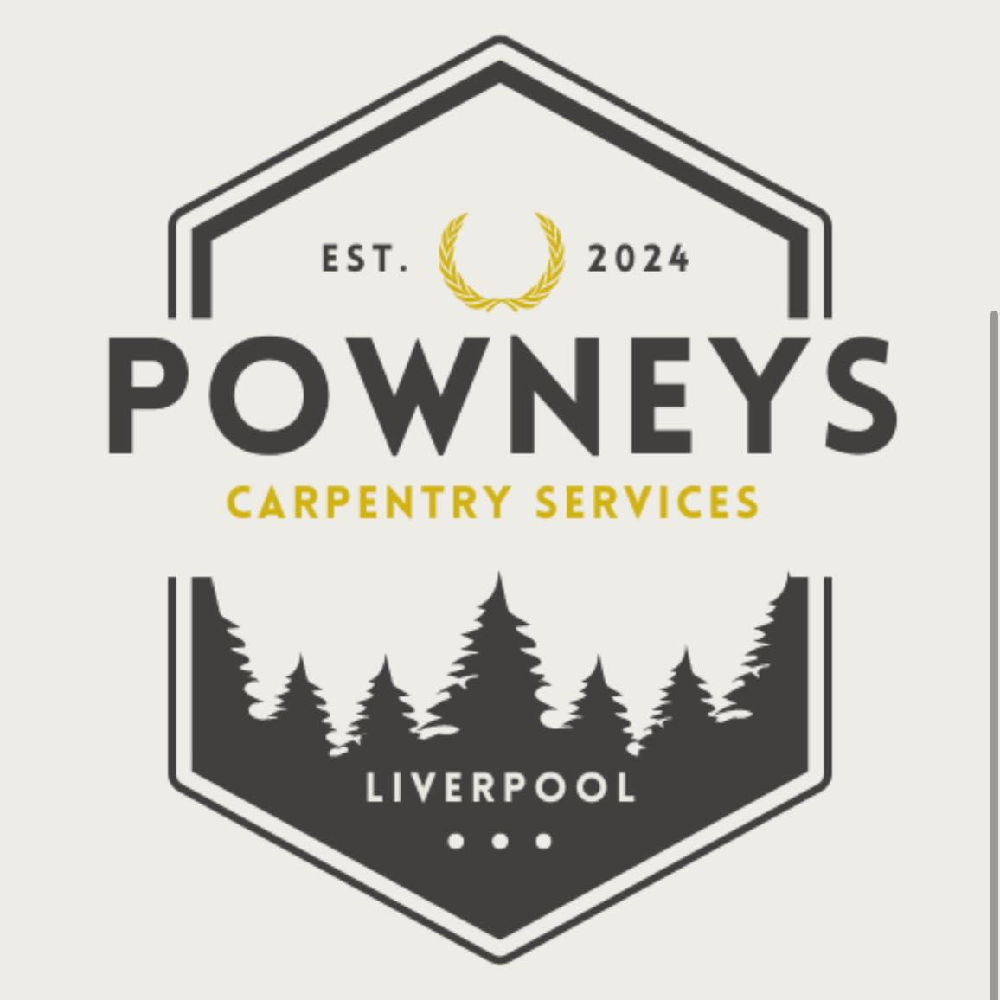

<p align="center">
  
</p>
<h1 align="center">Powneys Joinery</h1>

<p align="center"><i>Liverpool-based Carpentry & Joinery Services</i></p>
<p align="center">
  
  
  
  
</p>


## 🚀 Project Overview

Powneys Joinery is a professional carpentry and joinery company based in Liverpool. The website was designed to increase online visibility, showcase craftsmanship through a portfolio gallery, and provide potential customers with an easy way to request quotes or get in touch.


## ✨ Features

- **Mobile-First Design:** Looks great on all devices.
- **Project Gallery:** Displays recent work with high-quality images.
- **Customer Reviews:** Genuine feedback from clients.
- **Service Overview:** Clear, concise service descriptions.
- **Easy Contact:** Simple forms for enquiries and quotes.
- **SEO & Performance:** Optimised for search engines and fast loading.


## 🛠️ Tech Stack

- **Frontend:** React, Tailwind CSS
- **Assets:** AVIF/PNG images, SVG icons, Google Fonts
- **Deployment:** Static site currently hosted via GitHub Pages

  
## 📁 Project Structure

```
frontend/
├── public/         # Static assets and HTML
├── src/
│   ├── assets/     # Images and fonts
│   ├── components/ # Reusable React components
│   ├── data/       # Data files
│   ├── hooks/      # Custom React hooks
│   ├── utils/      # Utility functions and helpers
│   └── ...         # Other source files
├── package.json    # Project scripts and dependencies
└── ...             # Config files, README, etc.
```


## 🧑‍💻 Getting Started

1. **Install dependencies:**
    ```sh
    cd frontend
    npm install
    ```
2. **Run locally:**
    ```sh
    npm start
    ```
    Visit [http://localhost:3000](http://localhost:3000) in your browser.

3. **Build for production:**
    ```sh
    npm run build
    ```


## 🌐 Live Demo

[www.powneysjoinery.co.uk](https://www.powneysjoinery.co.uk/)

## 📄 License

This project is intended solely for portfolio and demonstration purposes.
All images, content, and code are the intellectual property of Powneys Joinery and Liam Jack Rogers.
Unauthorised use, reproduction, or distribution is strictly prohibited.
